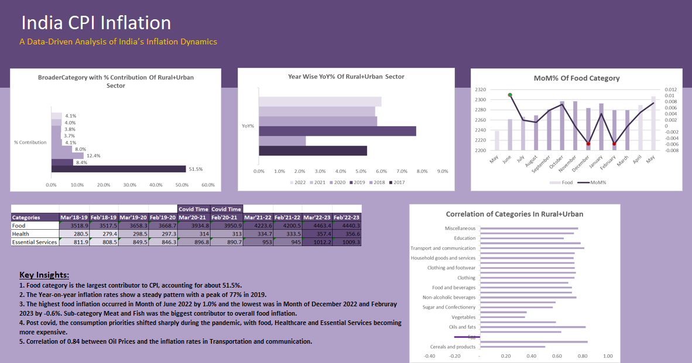

# India CPI Inflation Analysis

## Project Overview

This project analyzes India's Consumer Price Index (CPI) to understand inflation trends, category-level contributions, food inflation, 
the impact of COVID-19, and the relationship between imported crude oil prices and inflation.
The analysis covers CPI data across Rural, Urban, and Rural+Urban sectors and uses Microsoft Excel for data analysis, calculations, and visualization.
The project aims to transform CPI data into meaningful insights that can help understand major inflation drivers and changes in consumer price patterns over time.

## Business Problem

Inflation affects household purchasing power and the cost of essential goods and services. However, overall CPI figures alone do not show which categories are driving inflation or how inflation changes across different periods.

This project addresses the following business questions:

- Which broad CPI categories contribute the most to overall inflation?
- How has India's year-over-year CPI inflation changed over time?
- How has food inflation changed during the 12 months ending May 2023?
- How did the COVID-19 pandemic affect the prices of Food, Healthcare, and Essential Services?
- What relationship exists between imported crude oil prices and inflation across different CPI categories?

## Project Objectives

- Analyze the contribution of major CPI categories to overall inflation.
- Evaluate year-over-year CPI inflation trends across different years.
- Analyze monthly food inflation trends and identify periods of significant changes.
- Assess the impact of the COVID-19 pandemic on Food, Healthcare, and Essential Services.
- Examine the relationship between imported crude oil prices and inflation across CPI categories.
- Present the analysis through clear and interactive Excel-based visualizations.

## Tools & Technologies

- Microsoft Excel — Data analysis, calculations, and visualization
- Excel Functions — Statistical and analytical calculations
- Pivot Tables — Data summarization and category-level analysis
- Charts & Visualizations — Trend analysis and comparison

## Dataset Information

The project uses Consumer Price Index (CPI) data for India covering Rural, Urban, and Rural+Urban sectors.

The dataset contains CPI index values across different categories and time periods, which were used to analyze inflation trends, category contributions, food inflation, COVID-19 impact, and the relationship between crude oil prices and inflation.

### Key Data Areas

- CPI data across Rural, Urban, and Rural+Urban sectors
- Broad CPI category-level index values
- Food category data
- Monthly and yearly CPI values
- CPI data covering the analysis period from 2017 onward
- Imported crude oil price data for the oil-inflation analysis

### Source Files

- `All_India_CPI_Raw_Data.xlsx` — Raw CPI dataset
- `Oil_Price_Trend.xlsx` — Imported crude oil price data

## Analysis Performed

The analysis was performed across five key areas:

### 1. CPI Category Contribution
Analyzed the contribution of major CPI categories to understand which categories have the greatest influence on overall inflation.

### 2. Year-over-Year Inflation Trend
Calculated and analyzed year-over-year (YoY) changes in CPI to identify major changes in India's inflation pattern over time.

### 3. Food Inflation Trend
Analyzed monthly changes in the Food category over the 12-month period ending May 2023 to identify periods of increasing and decreasing food inflation.

### 4. COVID-19 Impact Analysis
Compared CPI movements in Food, Healthcare, and Essential Services during the COVID-19 period to understand how the pandemic affected essential consumption categories.

### 5. Crude Oil and Inflation Relationship
Analyzed the relationship between imported crude oil prices and inflation across selected CPI categories using correlation analysis.

## Key Findings

- Food was the largest contributor to overall CPI, accounting for approximately 51.5% of the contribution analyzed.
- Year-over-year CPI inflation showed significant variation across the analyzed years, with the highest observed rate occurring in 2019.
- Food inflation fluctuated considerably during the 12-month period analyzed, with both positive and negative month-over-month changes.
- During the COVID-19 period, essential categories such as Food, Healthcare, and Essential Services showed noticeable changes in their CPI levels.
- Crude oil prices showed a positive relationship with selected inflation categories, with the analysis indicating a strong correlation for Transportation and Communication.

## Dashboard Preview

The Excel dashboard provides an interactive view of India's CPI inflation trends, category-level contributions, food inflation, COVID-19 impact, and correlation analysis.

### India CPI Inflation Dashboard



## Project Workflow

```text
Raw CPI & Oil Price Data
        │
        ▼
Data Cleaning & Preparation
        │
        ▼
Data Analysis in Excel
        │
        ├── Category Contribution Analysis
        ├── YoY Inflation Trend Analysis
        ├── Food Inflation Analysis
        ├── COVID-19 Impact Analysis
        └── Oil Price & Inflation Correlation
        │
        ▼
Charts & Dashboard Creation
        │
        ▼
Key Insights & Findings


## Excel Concepts Used

- Data Cleaning and Preparation
- Data Sorting and Filtering
- Pivot Tables for Data Summarization
- Percentage Calculations
- Year-over-Year (YoY) and Month-over-Month (MoM) Analysis
- Correlation Analysis using `CORREL`
- Charts and Data Visualization
- Dashboard Creation


